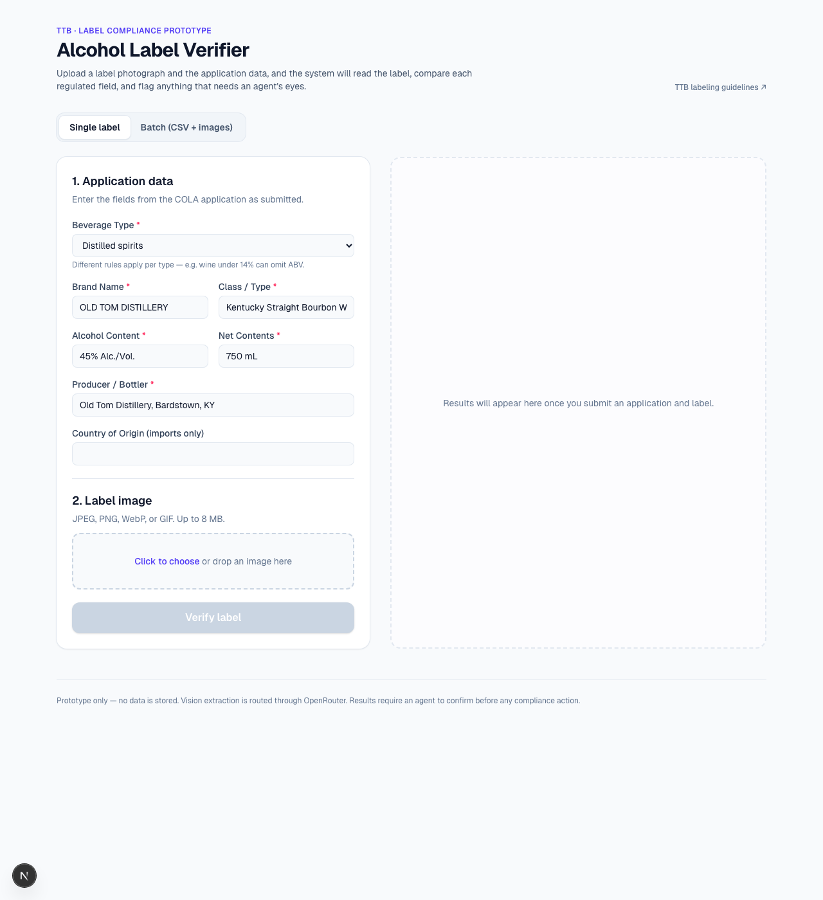

# TTB Alcohol Label Verifier

An AI-assisted prototype that helps TTB compliance agents verify alcohol beverage labels against the data submitted on a COLA application. The agent enters the application fields and uploads a photograph of the label; the app reads the label with a vision model, applies beverage-type-aware compliance rules, and surfaces a clear **pass / review / fail** verdict per field — in well under the 5-second budget the stakeholder interviews said was non-negotiable.

**Live demo:** <https://treasury-app-eosin.vercel.app>
**Repository:** <https://github.com/s85191939/Treasury-app>



---

## Contents

1. [What it does](#what-it-does)
2. [Spec coverage at a glance](#spec-coverage-at-a-glance)
3. [Try the live demo](#try-the-live-demo)
4. [Included test fixtures](#included-test-fixtures)
5. [Run it locally](#run-it-locally)
6. [Architecture](#architecture)
7. [How verification works](#how-verification-works)
8. [API reference](#api-reference)
9. [Model selection & measured latency](#model-selection--measured-latency)
10. [Design decisions, mapped to the interviews](#design-decisions-mapped-to-the-interviews)
11. [Testing](#testing)
12. [Limitations and known issues](#limitations-and-known-issues)
13. [Future work](#future-work)
14. [Deployment](#deployment)

---

## What it does

**Single-label mode**

1. Agent picks the beverage type (spirits / wine / beer) and enters the COLA application fields (brand, class/type, ABV, net contents, producer, optional country of origin).
2. Agent uploads a label photo (JPEG / PNG / WebP / GIF, up to 8 MB) — click or drag-and-drop.
3. The vision model extracts every regulated field as printed, classifies the beverage, and reports whether the Government Warning header is in **all-caps** and **bold**.
4. A deterministic comparator applies beverage-type-specific rules (e.g. wines under 14% can omit ABV; missing ABV on a beer is not required at the federal level) and renders a per-field verdict plus an overall pass / review / fail.
5. The Government Warning is checked strictly: exact canonical 27 CFR 16.21 text, header in all caps, header in bold. All three signals must agree. Other fields use fuzzy matching, so `STONE'S THROW` on a label still matches `Stone's Throw` on the application.
6. If the model flags the image as low-quality (angle, glare, occlusion) the UI surfaces that as a *Reviewer note* with a suggested "request a better photo" action.

**Batch mode**

- Upload one CSV of applications (one row per label) plus the matching image files. Filename pairing.
- Up to **4 verifications run in parallel**; rows update live ("3 of 12 verified") with pass/review/fail badges.
- Filter the table by status (All / Pass / Review / Fail), expand any row for the full breakdown, retry any failed row, and **export the results to CSV** ready for COLA reconciliation.

---

## Spec coverage at a glance

Every requirement called out in the briefing doc and the four stakeholder interviews is wired up. Below is a direct mapping. Each row links to the implementation.

### Regulated label fields (TTB)

| Field | Implementation |
| --- | --- |
| Brand name | Fuzzy compare in [`compare.ts`](src/lib/compare.ts) |
| Class / type designation | Fuzzy compare in [`compare.ts`](src/lib/compare.ts) |
| Alcohol content — with exceptions for wine/beer | Numeric tolerance + per-beverage-type exemption rules in [`compare.ts`](src/lib/compare.ts) |
| Net contents | Multi-unit parser (mL / L / cL / fl oz) in [`compare.ts`](src/lib/compare.ts) |
| Bottler / producer + address | Fuzzy compare on concatenated name+address |
| Country of origin (imports) | Optional fuzzy compare, shown only when the application sets it |
| Government Warning (mandatory) | Strict canonical-text + caps + bold check in [`compare.ts`](src/lib/compare.ts) |

### Stakeholder interview points

| Stakeholder ask | Implementation |
| --- | --- |
| Sarah: results in **~5 seconds** or nobody uses it | Default model is `google/gemini-2.5-flash`, measured ~2.4 s end-to-end |
| Sarah: **batch uploads** (peak-season 200–300) | Batch mode with 4-way parallel, filter, retry, CSV export |
| Sarah: UI my mother (73) could figure out | Big buttons, two tabs, sample data pre-filled, drag-and-drop with hover state, plain-language errors, live progress indicators |
| Marcus: **standalone prototype**, no COLA integration | Stateless Next.js app, single egress to OpenRouter |
| Marcus: **no PII storage** | Nothing persists; images live for the request lifetime then go away |
| Marcus: **firewall** considerations | One outbound host (`openrouter.ai`) — documented, `OPENROUTER_BASE_URL` overrideable for a gateway/proxy |
| Dave: **STONE'S THROW vs Stone's Throw** judgment | Normalised Levenshtein similarity for names — case + punctuation tolerant |
| Dave: don't make life harder | Two-click verification, instant feedback, sample CSV download |
| Jenny: warning must be **exact, all caps, bold** | Triple check: canonical text + `warning_header_in_all_caps` + `warning_header_is_bold`, all required |
| Jenny: handle **imperfect images** | Model has explicit guidance to flag image-quality issues via the `notes` field; UI surfaces them prominently |

### Deliverables checklist

- [x] Source code repository — <https://github.com/s85191939/Treasury-app>
- [x] README with setup and run instructions — this file
- [x] Brief documentation of approach, tools, assumptions — this file
- [x] Deployed application URL — <https://treasury-app-eosin.vercel.app>
- [x] Unit tests — 34 tests in [`compare.test.ts`](src/lib/compare.test.ts), `npm test`

---

## Try the live demo

The live deployment is open. From <https://treasury-app-eosin.vercel.app>:

1. Click **Single label** (selected by default).
2. The form is pre-filled for the `OLD TOM DISTILLERY` sample (a distilled spirits label).
3. Download [`samples/old-tom.jpg`](samples/old-tom.jpg) from the repo (or drag-drop it from your machine).
4. Hit **Verify label** — result appears in ~2-3 s.

To exercise the strict warning check:

1. Same flow, but upload [`samples/altered-warning.jpg`](samples/altered-warning.jpg). It looks almost identical, but the Government Warning header is in title case (`Government Warning:`) instead of caps.
2. The result is **Fail**, with the Government Warning row showing two red badges — `ALL CAPS` and (in some models) `Bold weight` — and a plain-language note: *"Header is not 'GOVERNMENT WARNING:' in all caps — TTB requires exact format."*

To exercise batch + beverage-type rules:

1. Click **Batch (CSV + images)**.
2. Click **Download sample CSV** (or upload [`samples/applications.csv`](samples/applications.csv)).
3. Upload all three images from `samples/` (`old-tom.jpg`, `altered-warning.jpg`, `chateau-margaux.jpg`).
4. Hit **Verify all** — two **Pass**, one **Fail**. Click **Export results CSV** to take the verdicts back to COLA.

---

## Included test fixtures

The `samples/` folder contains **eight** synthetic labels generated by a deterministic Python script ([`samples/generate.py`](samples/generate.py)). Each fixture exercises a different regulatory scenario so reviewers can see what the system was tested against without having to source real labels.

### Pass scenarios

| File | Scenario | What it proves |
| --- | --- | --- |
| `old-tom.jpg` | Clean bourbon label, all required fields, canonical Government Warning in bold all-caps | Happy-path spirits verification |
| `chateau-margaux.jpg` | Wine label with country of origin | Optional country-of-origin check + wine beverage classification |
| `wine-low-abv.jpg` | Chardonnay at 12.5% with ABV present | Wine ABV is checked when displayed |
| `wine-low-abv-missing.jpg` | Same Chardonnay, ABV omitted from the label | **Wine-under-14% exemption** — N/A status, doesn't block pass |
| `beer-ipa.jpg` | West Coast IPA at 6.8% | **Beer ABV exemption** + beer beverage classification |

### Fail scenarios

| File | Scenario | What it proves |
| --- | --- | --- |
| `altered-warning.jpg` | Warning header in title case (`Government Warning:`) | **Strict caps check** on the warning header |
| `regular-warning.jpg` | Warning header in all-caps but **regular weight** (not bold) | **Strict bold check** on the warning header |
| `wrong-abv.jpg` | Label says 50% ABV, application says 45% | ABV numeric tolerance — flags real mismatches |

`samples/applications.csv` pairs every image with its application data including the `beverage_class` column — drop the whole folder into batch mode and watch the verdicts come back live.

To regenerate the labels (requires `Pillow`):

```bash
pip install pillow
python3 samples/generate.py
```

---

## Run it locally

Prerequisites: **Node 20+** and an [OpenRouter](https://openrouter.ai/) API key.

```bash
git clone https://github.com/s85191939/Treasury-app.git
cd Treasury-app
npm install
cp .env.example .env.local            # paste your OPENROUTER_API_KEY
npm run dev
# → open http://localhost:3000
```

Run the test suite:

```bash
npm test           # one-shot
npm run test:watch # watch mode
```

Optional env vars (see [`.env.example`](.env.example)):

| Variable | Default | Notes |
| --- | --- | --- |
| `OPENROUTER_API_KEY` | (required) | Your OpenRouter key |
| `OPENROUTER_MODEL` | `google/gemini-2.5-flash` | Any OpenRouter vision + tool-calling model |
| `OPENROUTER_BASE_URL` | `https://openrouter.ai/api/v1` | For gateways/proxies |
| `OPENROUTER_HTTP_REFERER` | `http://localhost:3000` | Reported in OpenRouter analytics |

---

## Architecture

```
                        ┌───────────────────────┐
                        │   Browser (Next.js)   │
                        │  /app/page.tsx        │
                        │   ├─ SingleVerifier   │
                        │   └─ BatchVerifier    │
                        └─────────────┬─────────┘
                                      │ multipart/form-data
                                      │ (image + application JSON)
                                      ▼
                        ┌───────────────────────┐
                        │  POST /api/verify     │
                        │  src/app/api/verify   │
                        └─────────────┬─────────┘
                                      │
                       ┌──────────────┼──────────────┐
                       ▼              ▼              ▼
                ┌───────────┐  ┌────────────┐ ┌───────────────┐
                │ extract() │  │ compare()  │ │ overallStatus │
                │ → fields  │  │ → results  │ │ → pass/fail   │
                └─────┬─────┘  └────────────┘ └───────────────┘
                      │
                      ▼
                ┌───────────────────────┐
                │  OpenRouter           │
                │  /chat/completions    │
                │  (tool-use, vision)   │
                └───────────────────────┘
```

```
src/
├─ app/
│  ├─ api/verify/route.ts     # POST endpoint — validates input, runs extract+compare
│  ├─ layout.tsx
│  ├─ globals.css
│  └─ page.tsx                # tabs: single | batch
├─ components/
│  ├─ SingleVerifier.tsx      # left: form+upload, right: results, drag-drop, progress
│  ├─ BatchVerifier.tsx       # CSV+images, table, filters, retry, CSV export, 4× parallel
│  ├─ VerificationResult.tsx  # per-field results, ALL CAPS/Bold badges, reviewer notes
│  └─ StatusBadge.tsx         # pass / fail / review / missing / n/a pills with icons
└─ lib/
   ├─ extract.ts              # OpenRouter call (fetch + tool/function calling)
   ├─ compare.ts              # deterministic comparator + canonical warning text
   ├─ compare.test.ts         # 34 vitest unit tests
   ├─ csv.ts                  # minimal RFC-ish CSV parser (handles quotes & commas)
   └─ types.ts                # LabelApplication, ExtractedLabel, FieldResult, VerifyResponse
```

### Request flow for one label

1. Browser packages the image + a JSON-encoded `LabelApplication` (including `beverageClass`) into a `FormData` and POSTs `/api/verify`.
2. The route validates content-type, size (≤ 8 MB), and the application JSON.
3. `extract.ts` base64-encodes the image, calls OpenRouter with a `report_label_fields` tool and `tool_choice` pinned to it — so the model can only respond by filling the schema.
4. The extracted fields are normalised (producer name + address joined, empty strings → `null`, beverage class enum validated).
5. `compare.ts` applies beverage-type-aware rules and runs deterministic, auditable checks per field, producing a `FieldResult[]`.
6. Overall status is `fail` if any field fails or is missing, `review` if anything is `warning`, else `pass`. `n/a` results never block a pass.
7. The response is `{ extracted, results, overall, latencyMs }`.

---

## How verification works

Vision models are good at reading text. They are **not** the right place to make a regulatory decision — that needs to be deterministic, auditable, and unit-testable. So the model only does OCR-with-structure, and a pure-TypeScript comparator decides pass / review / fail.

### Per-field comparison

| Field | Strategy | Pass | Review | Fail / Other |
| --- | --- | --- | --- | --- |
| Beverage type | Enum match between application and model classification | exact match | model says "unknown" | mismatched class (e.g. wine label, spirits application) |
| Brand name | Normalised Levenshtein similarity | similarity = 1.0 | 0.85–0.99 | < 0.85 |
| Class / Type | Normalised Levenshtein similarity | similarity = 1.0 | 0.80–0.99 | < 0.80 |
| Alcohol Content | Parse `%` or `proof` (proof ÷ 2 = ABV), compare numerically; **type-aware exemption** | diff < 0.05% | 0.05 – 0.3% | > 0.3%, or missing when required |
| Net Contents | Parse `mL / L / cL / fl oz / oz`, normalise to mL | diff < 0.5 mL | within 2% of expected | otherwise |
| Producer / Bottler | Normalised Levenshtein on name+address | sim = 1.0 | 0.80–0.99 | < 0.80 |
| Country of Origin (optional) | Normalised Levenshtein similarity | sim = 1.0 | 0.85–0.99 | < 0.85 |
| **Government Warning** | **Strict, case-sensitive header check + bold check + exact-string body match** | exact canonical match, all-caps, bold | ≥ 98% body similar, all-caps, bold (OCR artefact) | header not in caps, OR header not bold, OR text deviates, OR missing |

Normalisation for fuzzy fields: lower-case, collapse whitespace, strip non-alphanumeric (except `% . / -`), unify curly quotes. This is what makes `STONE'S THROW` ≡ `Stone's Throw`.

### Beverage-type-aware ABV rules

The spec calls out *"alcohol content — with some exceptions for certain wine/beer"*. We model the exceptions:

| Beverage type | Missing ABV on the label is treated as |
| --- | --- |
| Spirits | **Missing** (regulatory fail) |
| Wine, expected ≥ 14% | **Missing** (regulatory fail) |
| Wine, expected < 14% | **N/A** ("Wine under 14% — ABV not required if class designation suffices") |
| Beer / malt | **N/A** at federal level (states vary; surfaced as a non-blocking note) |

`N/A` results show as grey "Not required" pills in the UI and never block a `pass`.

### The Government Warning

Hardcoded canonical text from 27 CFR 16.21:

> GOVERNMENT WARNING: (1) According to the Surgeon General, women should not drink alcoholic beverages during pregnancy because of the risk of birth defects. (2) Consumption of alcoholic beverages impairs your ability to drive a car or operate machinery, and may cause health problems.

Three independent checks must all pass:
1. The model returns the warning text verbatim and confirms `warning_header_in_all_caps=true`. The comparator additionally runs its own case-sensitive `startsWith("GOVERNMENT WARNING:")` on the returned text — both must agree, defending against models that silently auto-normalise case in their OCR output.
2. The model confirms `warning_header_is_bold=true` (bolder strokes than the surrounding body text, per TTB).
3. The body text matches the canonical wording (exact, or ≥ 98% similar to flag OCR-level differences as *Review* rather than *Fail*).

The UI renders two badges next to the warning field — `ALL CAPS` and `Bold weight` — green when the signal is true, red when false. This makes the strict rule visible at a glance for non-technical reviewers.

---

## API reference

### `POST /api/verify`

**Request:** `multipart/form-data`

| Field | Type | Required | Notes |
| --- | --- | --- | --- |
| `image` | `File` | yes | `image/jpeg`, `image/png`, `image/webp`, or `image/gif`, ≤ 8 MB |
| `application` | string (JSON) | yes | Encoded [`LabelApplication`](src/lib/types.ts) |

`LabelApplication`:

```ts
{
  brandName: string,           // required
  classType: string,           // required
  alcoholContent: string,      // required, e.g. "45% Alc./Vol." or "90 Proof"
  netContents: string,         // required, e.g. "750 mL"
  producer: string,            // required
  originCountry?: string,      // optional — only checked if provided
  beverageClass: "spirits" | "wine" | "beer" | "unknown"
}
```

**Response (200):** `VerifyResponse`

```ts
{
  extracted: {
    brandName, classType, alcoholContent, netContents,
    producer, originCountry, governmentWarning,
    warningStartsWithCapsHeader, warningHeaderIsBold,
    beverageClass, notes
  },
  results: FieldResult[],         // per-field comparison with status + note
  overall: "pass" | "fail" | "review",
  latencyMs: number               // server-measured end-to-end latency
}
```

**Errors:** all responses include a plain-language `error` string.

| Code | Meaning |
| --- | --- |
| `400` | Missing image, missing or invalid application JSON, malformed form |
| `413` | Image > 8 MB |
| `415` | Unsupported image MIME type |
| `500` | Server misconfigured (missing `OPENROUTER_API_KEY`) |
| `502` | OpenRouter call failed or returned unparseable output |

**Example:**

```bash
curl -s -X POST https://treasury-app-eosin.vercel.app/api/verify \
  -F 'application={"brandName":"OLD TOM DISTILLERY","classType":"Kentucky Straight Bourbon Whiskey","alcoholContent":"45% Alc./Vol.","netContents":"750 mL","producer":"Old Tom Distillery, Bardstown, KY","beverageClass":"spirits"}' \
  -F "image=@samples/old-tom.jpg"
```

---

## Model selection & measured latency

Measured end-to-end (curl → `/api/verify` → OpenRouter → response) against the `old-tom.jpg` sample, three runs averaged, from a residential macOS box. Numbers move around in the network; treat them as orders of magnitude.

| Model | Avg latency | Notes |
| --- | --- | --- |
| `google/gemini-2.5-flash` *(default)* | **~2.4 s** | Comfortably inside Sarah's 5 s budget; reliable tool-use. Recommended. |
| `anthropic/claude-haiku-4.5` | ~3.5 s | Very accurate, slightly slower. |
| `anthropic/claude-sonnet-4.5` | ~5.6 s | Highest fidelity, but borderline against the 5 s budget. |
| `openai/gpt-4o` | varies | Solid OCR, latency depends on routing. |

Swap by setting `OPENROUTER_MODEL` — no code change. The tool/function-call schema is in OpenAI-compatible form, so any major provider supported by OpenRouter works.

---

## Design decisions, mapped to the interviews

| Decision | Why, and which interview note it ties to |
| --- | --- |
| **Next.js + TypeScript + Tailwind on Vercel** | One repo, one deploy target, no separate API server to operate. Marcus stressed the pain of FedRAMP / .NET / firewall procurement — a stateless app with one outbound call is the easiest thing to argue for in a follow-up. |
| **No COLA integration** | Marcus said the prototype is explicitly standalone. Everything is in-memory; the only egress is the OpenRouter API. |
| **OpenRouter abstraction** | Single API key for many models — lets a future procurement swap providers without code changes. Reduces vendor lock-in. |
| **`google/gemini-2.5-flash` as the default** | Sarah: *"If we can't get results back in about 5 seconds, nobody's going to use it."* Gemini Flash measures ~2.4 s end-to-end with margin. Stronger models are one env var away. |
| **Tool/function calling for structured output** | The model can only respond by filling the `report_label_fields` schema — no JSON-in-markdown parsing, no prose to strip, no schema drift between requests. |
| **Deterministic comparator (TypeScript), not "ask the model to decide"** | Regulatory decisions need to be auditable and reproducible. The same expected/found pair will always produce the same status. The model is restricted to reading text; the law is enforced by code with unit tests. |
| **Per-beverage-type rules** | The spec explicitly says *"requirements vary by beverage type"*. ABV missing on a 12% wine is fine (class designation does the job); ABV missing on whiskey is a hard fail. |
| **Fuzzy match for names, strict for the Government Warning** | Dave's STONE'S THROW vs Stone's Throw example: that should be **Pass**, not Fail. Jenny's `GOVERNMENT WARNING:` vs `Government Warning:` example: that **must** be Fail. Both behaviours are covered explicitly and unit-tested. |
| **Triple-check on the warning (text + caps + bold)** | Jenny: *"It has to be exact. Like, word-for-word, and the 'GOVERNMENT WARNING:' part has to be in all caps and bold."* Encoded as three separate signals; all three must agree. |
| **Numeric tolerance for ABV (0.05% / 0.3%) and volume (0.5 mL / 2%)** | Bottling and OCR introduce rounding. A label that reads `45.0%` vs an application that says `45%` should clearly pass; a label that reads `12%` against an application of `12.5%` is a review case worth eyeballing. |
| **Batch via CSV + image files, paired by filename** | Janet's request from the Seattle office. Concurrency capped at 4 for safety with rate limits; the UI streams updates per row, supports filtering and retry, and exports results to CSV so an agent can drop verdicts back into COLA. |
| **`n/a` status (grey "Not required" pill)** | Surfaces *why* a check was skipped, without polluting pass/fail counts. Built specifically for the wine-ABV exemption. |
| **Plain-language error messages** | "Image is too large. Please keep it under 8 MB." instead of "413 Payload Too Large." Sarah's mom test. |
| **Drag-and-drop with hover state, progress text, live batch counter** | Sarah: *"My mother could figure it out"* (73-year-old who learned to video call last year). Big buttons, no hidden state, every field labelled, every async action narrated. |
| **Reviewer notes from the model surfaced as a yellow callout** | Jenny's wish: handle bad photos. When the model is uncertain (angled, glare, occlusion) it can write a free-text note. The UI surfaces it with a *"Consider requesting a clearer photograph"* nudge. |
| **No persistence at all** | Marcus: *"Just don't do anything crazy. We're not storing anything sensitive for this exercise."* Images and form data live for the duration of the request, then go away. No PII in logs. |
| **`compare.ts` is pure and unit-tested** | Auditability. 34 vitest tests cover every comparison rule including the case fail, bold fail, beverage-type exemptions, and Dave's case-insensitivity edge cases. |

---

## Testing

```bash
npm test
```

```
✓ similarity (2 + 4 boundary cases)
✓ parsePercent (4 + 3 edge cases)
✓ parseVolumeMl (3 + 3 unit-coverage cases)
✓ compareFields — happy path (1)
✓ compareFields — Dave's STONE'S THROW judgment (2)
✓ compareFields — Government Warning strictness (Jenny's rule) (5)
✓ compareFields — Government Warning near-miss handling (3)
✓ compareFields — ABV tolerance (4)
✓ compareFields — beverage-type ABV exemption (4)
✓ compareFields — ABV exemption corner cases (3)
✓ compareFields — volume tolerance (3)
✓ compareFields — beverage class mismatch (3)
✓ compareFields — class/type fuzzy edge cases (2)
✓ compareFields — country of origin (3)
✓ overallStatus (3)
✓ parseCsv (11 cases — quoted fields, CRLF, escaped quotes, embedded newlines, …)

Test Files  2 passed (2)
     Tests  66 passed (66)
```

The tests pin every comparison rule — including the regulatory edge cases each stakeholder called out by name — so a future change can't silently break a compliance behaviour. The CSV parser tests cover the messy real-world cases (commas-in-quotes, escaped quotes, CRLF) that an importer's "200-300 label dump" might throw at it.

---

## Limitations and known issues

- **Vision OCR accuracy is the floor of the system.** The comparator is deterministic, but if the model misreads a number, the verdict is wrong. The `notes` field is the safety valve.
- **Bold detection is the noisiest signal.** Models can be inconsistent about typography weight at small font sizes — fine on real labels with sharp contrast, less reliable on heavily-compressed photos. We mitigate by also requiring `warning_header_in_all_caps`; weight alone never blocks a pass.
- **OpenRouter must be reachable.** Marcus warned about TTB's outbound firewalls; production would need an allowlist for `openrouter.ai` (or swap to a direct provider that's already approved, e.g. Bedrock in GovCloud).
- **Canonical warning text is hardcoded.** It's the current 27 CFR 16.21 wording. A real deployment would version this and pull from a managed source.
- **Batch concurrency is capped at 4** to stay friendly to typical OpenRouter rate limits. Production should queue, retry, and back off on 429s.
- **CSV pairing is by filename, case-sensitive.** Simple and predictable, but not forgiving — `Foo.jpg` and `foo.jpg` won't match. Production would pull straight from COLA application records.
- **No authentication.** Per Marcus's "standalone proof-of-concept" framing. Production would sit behind agent SSO.
- **No persisted audit log.** Every verification is ephemeral. A real deployment would append-only-log every verdict for downstream COLA reconciliation.

---

## Future work

Order roughly by *impact-per-hour-of-engineering*:

1. **CSV/Excel-format-aware sample download** — generate the sample CSV with header docstrings explaining each column.
2. **A "needs re-photograph" workflow** — when the model emits a `notes` field, auto-fill the agent's standard request-for-better-image template.
3. **Versioned canonical warning + class-type taxonomy**, loaded from a small server-side config so legal can update without a deploy.
4. **Retry with a stronger model on `review` outcomes** — keep Flash for the cheap fast pass, escalate to Sonnet/GPT-4o only for borderline cases.
5. **Side-by-side image viewer** with zoom + boxes drawn around the extracted fields so the agent can visually confirm what the model "saw".
6. **Throughput tuning for 200-300 label peak-season batches** — server-side queue, per-customer concurrency, OCR cost budget per upload.
7. **Auditability** — append-only log of every verification (image hash, application data, extracted fields, verdict, model name, timestamp) for downstream COLA reconciliation.
8. **Class/type taxonomy enforcement** — e.g. "Kentucky Straight Bourbon" must be produced in Kentucky.

---

## Deployment

The live deployment is on Vercel at <https://treasury-app-eosin.vercel.app>.

To deploy your own copy:

1. Fork or import this repository on Vercel ([vercel.com/new](https://vercel.com/new)).
2. Add `OPENROUTER_API_KEY` (and optionally `OPENROUTER_MODEL`) under **Project Settings → Environment Variables**.
3. Deploy. No build configuration required — Vercel auto-detects Next.js.

Or from this directory with the Vercel CLI:

```bash
vercel link
echo "$OPENROUTER_API_KEY" | vercel env add OPENROUTER_API_KEY production
vercel deploy --prod
```
